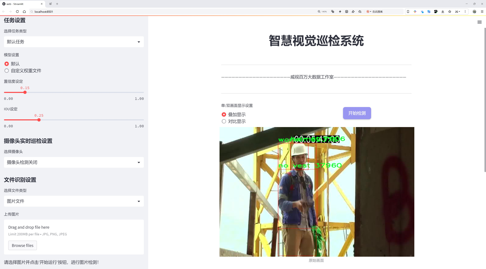
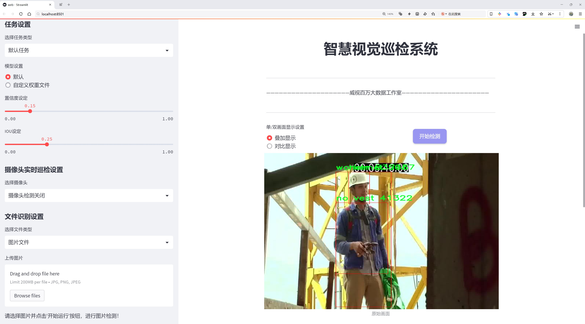
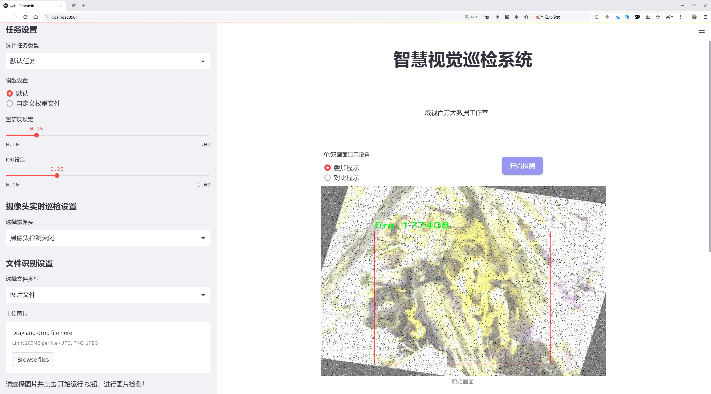
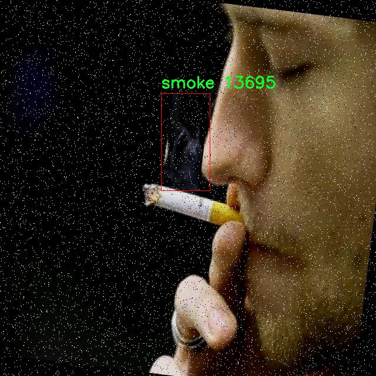
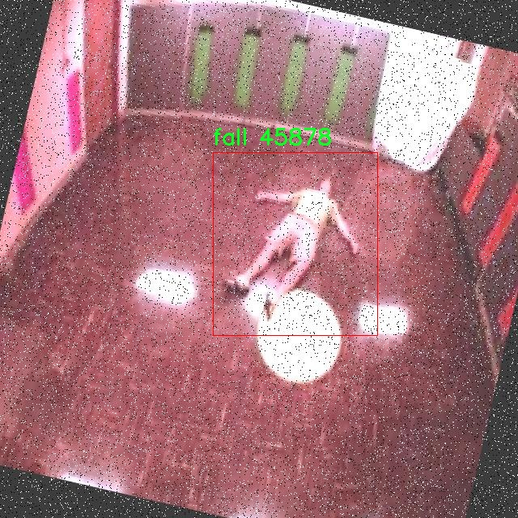
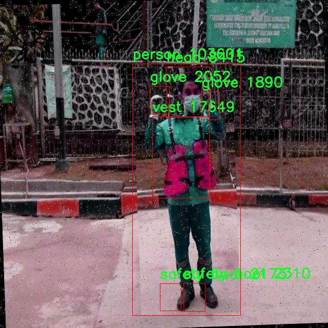
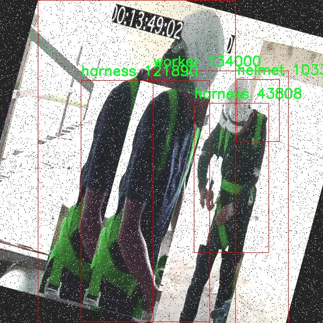
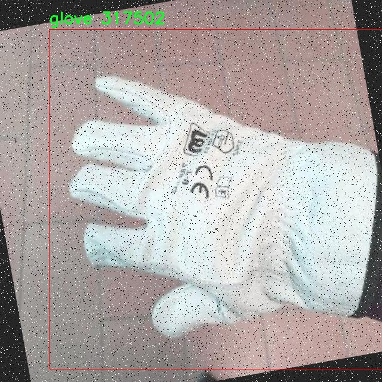

# 工地高空安全防护装备检测检测系统源码分享
 # [一条龙教学YOLOV8标注好的数据集一键训练_70+全套改进创新点发刊_Web前端展示]

### 1.研究背景与意义

项目参考[AAAI Association for the Advancement of Artificial Intelligence](https://gitee.com/qunshansj/projects)

项目来源[AACV Association for the Advancement of Computer Vision](https://gitee.com/qunmasj/projects)

研究背景与意义

随着城市化进程的加快，建筑工地的数量不断增加，工地安全问题日益凸显。根据统计数据，建筑行业的事故发生率仍然高于其他行业，尤其是在高空作业时，工人面临着坠落、物体打击等多种安全隐患。因此，如何有效监测和管理工地的安全防护装备，确保工人的安全，成为了亟待解决的重要课题。近年来，计算机视觉技术的迅猛发展为工地安全管理提供了新的解决方案。特别是基于深度学习的目标检测技术，能够实现对工地安全防护装备的实时监测与识别，为提升工地安全管理水平提供了强有力的技术支持。

本研究旨在基于改进的YOLOv8模型，构建一个高效的工地高空安全防护装备检测系统。YOLO（You Only Look Once）系列模型以其高效的实时检测能力和较高的准确率，成为目标检测领域的主流方法之一。通过对YOLOv8模型的改进，结合特定的工地安全防护装备数据集，我们希望能够提高检测的精度和速度，从而实现对工地安全防护装备的全面监控。该数据集包含6400张图像，涵盖20个类别，包括反光夹克、安全帽、手套、安全靴等多种防护装备，能够为模型的训练和测试提供丰富的样本支持。

在实际应用中，工地高空作业的安全防护装备种类繁多，且不同类型的装备在功能和外观上存在差异。通过对这些装备进行准确识别，不仅可以帮助管理人员及时发现未佩戴或佩戴不当的情况，还能为工人提供实时的安全提醒，降低事故发生的风险。此外，基于深度学习的检测系统能够在大规模工地环境中进行高效的监控，减少人工巡查的工作量，提高管理效率。

本研究的意义不仅在于技术层面的创新，更在于对工地安全管理模式的变革。通过引入智能化的检测系统，能够推动建筑行业向数字化、智能化方向发展，提升整体安全管理水平。同时，该系统的成功应用也为其他行业的安全监测提供了借鉴，具有广泛的推广价值。综上所述，基于改进YOLOv8的工地高空安全防护装备检测系统的研究，不仅具有重要的理论意义，更具备显著的实际应用价值，能够为保障工人安全、提升工地管理效率做出积极贡献。

### 2.图片演示







##### 注意：由于此博客编辑较早，上面“2.图片演示”和“3.视频演示”展示的系统图片或者视频可能为老版本，新版本在老版本的基础上升级如下：（实际效果以升级的新版本为准）

  （1）适配了YOLOV8的“目标检测”模型和“实例分割”模型，通过加载相应的权重（.pt）文件即可自适应加载模型。

  （2）支持“图片识别”、“视频识别”、“摄像头实时识别”三种识别模式。

  （3）支持“图片识别”、“视频识别”、“摄像头实时识别”三种识别结果保存导出，解决手动导出（容易卡顿出现爆内存）存在的问题，识别完自动保存结果并导出到tempDir中。

  （4）支持Web前端系统中的标题、背景图等自定义修改，后面提供修改教程。

  另外本项目提供训练的数据集和训练教程,暂不提供权重文件（best.pt）,需要您按照教程进行训练后实现图片演示和Web前端界面演示的效果。

### 3.视频演示

[3.1 视频演示](https://www.bilibili.com/video/BV1Ng4deZEdb/)

### 4.数据集信息展示

##### 4.1 本项目数据集详细数据（类别数＆类别名）

nc: 20
names: ['-Reflective-Jacket-', '-Safety-Helmet-', 'blue-helmet', 'fall', 'fire', 'glove', 'hardhat', 'harness', 'head', 'helmet', 'no helmet', 'no vest', 'person', 'red-helmet', 'safety boot', 'smoke', 'vest', 'white-helmet', 'worker', 'yellow-helmet']


##### 4.2 本项目数据集信息介绍

数据集信息展示

在构建高效的工地高空安全防护装备检测系统的过程中，数据集的选择与构建至关重要。本项目所采用的数据集名为“FINAL-PROJECT”，其设计旨在为改进YOLOv8模型提供丰富且多样化的训练样本，以提升其在实际应用中的准确性和鲁棒性。该数据集包含20个类别，涵盖了工地现场常见的安全防护装备及相关环境因素，具体类别包括：反光夹克、安全头盔、蓝色头盔、坠落、火灾、手套、安全帽、安全带、头部、头盔、无头盔、无背心、人员、红色头盔、安全靴、烟雾、背心、白色头盔、工人和黄色头盔。

数据集的多样性体现在其类别的广泛性上。反光夹克和安全帽是工地上最基本的防护装备，它们的存在与否直接关系到工人的安全。而不同颜色的头盔（如蓝色、红色、白色和黄色）不仅在视觉上提供了多样性，也可能代表不同的工种或职责，这对于现场管理和安全监控具有重要意义。此外，数据集中还包括了诸如“无头盔”和“无背心”的类别，这一设计旨在帮助模型识别潜在的安全隐患，及时发出警示。

值得注意的是，数据集中还涵盖了一些与安全相关的环境因素，如“坠落”、“火灾”和“烟雾”。这些类别的引入不仅丰富了数据集的内容，也使得模型在面对复杂工地环境时，能够更好地进行判断和识别。例如，识别“坠落”这一类别可以帮助及时发现工人可能面临的危险，从而采取必要的预防措施。而“火灾”和“烟雾”则是与工地安全密切相关的紧急情况，能够帮助提升应急响应能力。

在工地安全管理中，工人的行为和装备的状态是评估安全风险的重要指标。因此，数据集中还包含了“人员”和“工人”这两个类别，旨在帮助模型准确识别现场工作人员的状态和位置，从而实现对工地安全的全面监控。通过对“安全靴”、“手套”等防护装备的识别，模型能够判断工人是否佩戴了必要的安全装备，进而降低事故发生的风险。

综上所述，“FINAL-PROJECT”数据集不仅为YOLOv8模型的训练提供了丰富的样本，也为工地高空安全防护装备的检测系统奠定了坚实的基础。通过对多种类别的综合分析和识别，该系统将能够有效提升工地安全管理的智能化水平，保障工人的生命安全和健康。在未来的研究与应用中，数据集的不断优化与扩展将进一步推动工地安全防护技术的发展。











### 5.全套项目环境部署视频教程（零基础手把手教学）

[5.1 环境部署教程链接（零基础手把手教学）](https://www.ixigua.com/7404473917358506534?logTag=c807d0cbc21c0ef59de5)


[5.2 安装Python虚拟环境创建和依赖库安装视频教程链接（零基础手把手教学）](https://www.ixigua.com/7404474678003106304?logTag=1f1041108cd1f708b01a)

### 6.手把手YOLOV8训练视频教程（零基础小白有手就能学会）

[6.1 手把手YOLOV8训练视频教程（零基础小白有手就能学会）](https://www.ixigua.com/7404477157818401292?logTag=d31a2dfd1983c9668658)

### 7.70+种全套YOLOV8创新点代码加载调参视频教程（一键加载写好的改进模型的配置文件）

[7.1 70+种全套YOLOV8创新点代码加载调参视频教程（一键加载写好的改进模型的配置文件）](https://www.ixigua.com/7404478314661806627?logTag=29066f8288e3f4eea3a4)

### 8.70+种全套YOLOV8创新点原理讲解（非科班也可以轻松写刊发刊，V10版本正在科研待更新）

由于篇幅限制，每个创新点的具体原理讲解就不一一展开，具体见下列网址中的创新点对应子项目的技术原理博客网址【Blog】：


[8.1 70+种全套YOLOV8创新点原理讲解链接](https://gitee.com/qunmasj/good)

### 9.系统功能展示（检测对象为举例，实际内容以本项目数据集为准）

图9.1.系统支持检测结果表格显示

  图9.2.系统支持置信度和IOU阈值手动调节

  图9.3.系统支持自定义加载权重文件best.pt(需要你通过步骤5中训练获得)

  图9.4.系统支持摄像头实时识别

  图9.5.系统支持图片识别

  图9.6.系统支持视频识别

  图9.7.系统支持识别结果文件自动保存

  图9.8.系统支持Excel导出检测结果数据


### 10.原始YOLOV8算法原理

原始YOLOv8算法原理

YOLOv8算法是目标检测领域的一个重要里程碑，其设计理念和技术架构在前几代YOLO模型的基础上进行了深度优化与创新。作为YOLO系列的最新版本，YOLOv8不仅继承了YOLOv3和YOLOv5的核心思想，还融合了YOLOX、YOLOv6、YOLOv7及PPYOLOE等算法的优点，形成了一种高效、准确且具有实时检测能力的目标检测模型。

在数据预处理方面，YOLOv8依然采用了YOLOv5所使用的增强策略。这一策略包括马赛克增强、混合增强、空间扰动和颜色扰动等多种手段，旨在通过多样化的训练样本来提高模型的泛化能力。马赛克增强通过将多个图像拼接在一起，增加了样本的多样性；混合增强则通过对图像进行加权组合，进一步丰富了训练数据的特征分布。这些增强手段的应用，使得YOLOv8在面对复杂环境时，能够更好地识别和定位目标。

在骨干网络结构方面，YOLOv8延续了YOLOv5的设计思路，但在此基础上进行了重要的改进。YOLOv8将原有的C3模块替换为更为轻量化的C2f模块。C2f模块通过引入更多的分支，增强了特征提取过程中的梯度回传能力，从而提升了网络的学习效率。这种设计不仅降低了计算复杂度，还提高了特征提取的精度，使得YOLOv8在多尺度目标检测中表现得更加出色。

YOLOv8依然采用了特征金字塔网络（FPN）和路径聚合网络（PAN）的结构，以充分融合多尺度信息。FPN和PAN的结合使得不同层次的特征能够有效地传递和融合，从而提升了模型对小目标和大目标的检测能力。与YOLOv5相比，YOLOv8在FPN-PAN结构中将C3模块替换为C2f模块，进一步增强了特征融合的效果，使得模型在处理复杂场景时能够更好地捕捉目标的细节信息。

在检测头的设计上，YOLOv8采用了解耦头的结构，这一结构的引入使得分类和定位任务可以并行进行，从而提高了检测的效率和准确性。解耦头通过两条并行的分支分别提取类别特征和位置特征，并使用1×1卷积层分别完成分类和定位任务。这种设计不仅简化了网络结构，还有效地降低了模型的计算负担，使得YOLOv8在实时检测场景中表现得更加出色。

在标签分配策略方面，YOLOv8采用了动态标签分配策略，避免了传统候选框聚类方法的局限性。YOLOv8的标签分配基于目标框和目标分数的动态匹配，不再依赖于静态的候选框设置。这一策略使得模型能够更灵活地适应不同数据集的特征分布，提升了正负样本的匹配效率。YOLOv8的损失函数设计也进行了创新，分类损失采用了变焦损失（Varifocal Loss），而回归损失则结合了CIoU损失和DFL损失。这种新的损失策略通过对正负样本进行加权处理，使得模型在训练过程中能够更加关注高质量的正样本，从而提高了检测精度。

总体而言，YOLOv8在多个方面进行了深度优化，结合了先进的网络结构、灵活的标签分配策略和创新的损失函数设计，使得其在目标检测任务中表现出色。YOLOv8不仅具备高精度和快速响应的能力，还在处理复杂场景和多尺度目标时展现出了优越的性能。这些特性使得YOLOv8在自动驾驶、智能监控、工业检测等多个领域具有广泛的应用前景。

随着YOLOv8的发布，目标检测技术的研究和应用将迎来新的发展机遇。其高效的特征提取能力和灵活的标签分配策略为未来的目标检测算法提供了新的思路和方向。研究者们可以在YOLOv8的基础上，进一步探索轻量化模型、实时检测和多任务学习等领域的应用，推动目标检测技术的不断进步。


### 11.项目核心源码讲解（再也不用担心看不懂代码逻辑）

#### 11.1 70+种YOLOv8算法改进源码大全和调试加载训练教程（非必要）\ultralytics\utils\callbacks\mlflow.py

以下是经过简化和注释的核心代码部分，保留了主要功能，并对每个部分进行了详细的中文注释：

```python
# 导入必要的库
from ultralytics.utils import LOGGER, RUNS_DIR, SETTINGS, TESTS_RUNNING, colorstr

try:
    import os
    import mlflow  # 导入MLflow库

    # 确保不在测试环境中运行，并且MLflow集成已启用
    assert not TESTS_RUNNING or 'test_mlflow' in os.environ.get('PYTEST_CURRENT_TEST', '')
    assert SETTINGS['mlflow'] is True  # 验证集成是否启用
    assert hasattr(mlflow, '__version__')  # 验证mlflow包是否正确导入
    from pathlib import Path
    PREFIX = colorstr('MLflow: ')  # 设置日志前缀

except (ImportError, AssertionError):
    mlflow = None  # 如果导入失败，mlflow设为None


def on_pretrain_routine_end(trainer):
    """
    在预训练结束时记录训练参数到MLflow。

    Args:
        trainer (ultralytics.engine.trainer.BaseTrainer): 训练对象，包含要记录的参数。

    环境变量:
        MLFLOW_TRACKING_URI: MLflow跟踪的URI，默认为'runs/mlflow'。
        MLFLOW_EXPERIMENT_NAME: MLflow实验的名称，默认为trainer.args.project。
        MLFLOW_RUN: MLflow运行的名称，默认为trainer.args.name。
    """
    global mlflow

    # 获取跟踪URI
    uri = os.environ.get('MLFLOW_TRACKING_URI') or str(RUNS_DIR / 'mlflow')
    LOGGER.debug(f'{PREFIX} tracking uri: {uri}')
    mlflow.set_tracking_uri(uri)  # 设置跟踪URI

    # 设置实验和运行名称
    experiment_name = os.environ.get('MLFLOW_EXPERIMENT_NAME') or trainer.args.project or '/Shared/YOLOv8'
    run_name = os.environ.get('MLFLOW_RUN') or trainer.args.name
    mlflow.set_experiment(experiment_name)  # 设置实验

    mlflow.autolog()  # 自动记录参数和指标
    try:
        # 开始一个新的运行
        active_run = mlflow.active_run() or mlflow.start_run(run_name=run_name)
        LOGGER.info(f'{PREFIX}logging run_id({active_run.info.run_id}) to {uri}')
        mlflow.log_params(dict(trainer.args))  # 记录训练参数
    except Exception as e:
        LOGGER.warning(f'{PREFIX}WARNING ⚠️ Failed to initialize: {e}\n'
                       f'{PREFIX}WARNING ⚠️ Not tracking this run')


def on_fit_epoch_end(trainer):
    """在每个训练周期结束时记录训练指标到MLflow。"""
    if mlflow:
        # 清理指标名称并记录
        sanitized_metrics = {k.replace('(', '').replace(')', ''): float(v) for k, v in trainer.metrics.items()}
        mlflow.log_metrics(metrics=sanitized_metrics, step=trainer.epoch)  # 记录指标


def on_train_end(trainer):
    """在训练结束时记录模型工件。"""
    if mlflow:
        # 记录最佳模型的文件
        mlflow.log_artifact(str(trainer.best.parent))
        # 记录保存目录中的所有文件
        for f in trainer.save_dir.glob('*'):
            if f.suffix in {'.png', '.jpg', '.csv', '.pt', '.yaml'}:
                mlflow.log_artifact(str(f))

        mlflow.end_run()  # 结束当前运行
        LOGGER.info(f'{PREFIX}results logged to {mlflow.get_tracking_uri()}')


# 定义回调函数字典
callbacks = {
    'on_pretrain_routine_end': on_pretrain_routine_end,
    'on_fit_epoch_end': on_fit_epoch_end,
    'on_train_end': on_train_end} if mlflow else {}
```

### 代码说明：
1. **导入部分**：导入了必要的库和模块，包括Ultralytics的工具和MLflow库。
2. **异常处理**：尝试导入MLflow并进行基本的检查，确保在非测试环境中运行且MLflow集成已启用。
3. **`on_pretrain_routine_end`函数**：在预训练结束时记录训练参数，包括设置跟踪URI、实验名称和运行名称。
4. **`on_fit_epoch_end`函数**：在每个训练周期结束时记录训练指标。
5. **`on_train_end`函数**：在训练结束时记录模型工件，包括最佳模型和其他相关文件。
6. **回调函数字典**：根据是否成功导入MLflow来定义回调函数。

这个文件是一个用于Ultralytics YOLO（You Only Look Once）模型的MLflow日志记录模块。MLflow是一个开源平台，用于管理机器学习生命周期，包括实验跟踪、模型注册和部署等。该模块的主要功能是记录训练过程中的参数、指标和模型工件，以便后续分析和比较。

首先，文件开头的文档字符串简要说明了该模块的功能，并提供了一些基本的命令行操作指南，例如如何设置项目名称、运行名称以及如何启动本地的MLflow服务器。这些命令可以通过环境变量或直接在代码中传递参数来实现。

接下来，代码导入了一些必要的库和模块，包括Ultralytics的日志记录器、运行目录、设置和颜色字符串工具。然后，尝试导入MLflow库，并进行了一些基本的检查，例如确保在运行测试时不记录日志，以及确保MLflow集成已启用。

在定义的三个主要回调函数中，`on_pretrain_routine_end`函数在预训练过程结束时被调用。它负责设置MLflow的跟踪URI、实验名称和运行名称，并启动一个新的MLflow运行。该函数还会记录训练器的参数，以便后续查看。

`on_fit_epoch_end`函数在每个训练周期结束时被调用，负责记录当前周期的训练指标。它会对指标进行处理，确保它们的格式适合MLflow记录。

`on_train_end`函数在训练结束时被调用，负责记录模型的工件，包括最佳模型权重和其他相关文件（如图像、CSV文件等）。最后，它会结束当前的MLflow运行，并记录结果的URI，方便用户查看。

最后，代码通过一个字典将这些回调函数与MLflow的集成关联起来，只有在成功导入MLflow的情况下，才会注册这些回调函数。这样设计使得模块在没有MLflow的情况下也能正常工作，而不会导致错误。

总的来说，这个文件提供了一种方便的方式来集成MLflow，以便在训练YOLO模型时记录和管理实验数据，帮助用户更好地跟踪和分析模型性能。

#### 11.2 code\ultralytics\models\rtdetr\train.py

以下是代码中最核心的部分，并附上详细的中文注释：

```python
from copy import copy
import torch
from ultralytics.models.yolo.detect import DetectionTrainer
from ultralytics.nn.tasks import RTDETRDetectionModel
from ultralytics.utils import RANK, colorstr
from .val import RTDETRDataset, RTDETRValidator

class RTDETRTrainer(DetectionTrainer):
    """
    RT-DETR模型的训练类，继承自YOLO的DetectionTrainer类。
    RT-DETR是百度开发的实时目标检测模型，利用视觉变换器（Vision Transformers）进行目标检测。
    """

    def get_model(self, cfg=None, weights=None, verbose=True):
        """
        初始化并返回一个用于目标检测任务的RT-DETR模型。

        参数:
            cfg (dict, optional): 模型配置，默认为None。
            weights (str, optional): 预训练模型权重的路径，默认为None。
            verbose (bool): 如果为True，则启用详细日志，默认为True。

        返回:
            (RTDETRDetectionModel): 初始化后的模型。
        """
        # 创建RT-DETR检测模型实例
        model = RTDETRDetectionModel(cfg, nc=self.data["nc"], verbose=verbose and RANK == -1)
        if weights:
            model.load(weights)  # 如果提供了权重，则加载权重
        return model

    def build_dataset(self, img_path, mode="val", batch=None):
        """
        构建并返回用于训练或验证的RT-DETR数据集。

        参数:
            img_path (str): 包含图像的文件夹路径。
            mode (str): 数据集模式，可以是'train'或'val'。
            batch (int, optional): 矩形训练的批量大小，默认为None。

        返回:
            (RTDETRDataset): 特定模式的数据集对象。
        """
        # 创建RT-DETR数据集实例
        return RTDETRDataset(
            img_path=img_path,
            imgsz=self.args.imgsz,
            batch_size=batch,
            augment=mode == "train",  # 如果是训练模式，则进行数据增强
            hyp=self.args,
            rect=False,
            cache=self.args.cache or None,
            prefix=colorstr(f"{mode}: "),  # 添加模式前缀
            data=self.data,
        )

    def get_validator(self):
        """
        返回适合RT-DETR模型验证的检测验证器。

        返回:
            (RTDETRValidator): 用于模型验证的验证器对象。
        """
        self.loss_names = "giou_loss", "cls_loss", "l1_loss"  # 定义损失名称
        return RTDETRValidator(self.test_loader, save_dir=self.save_dir, args=copy(self.args))

    def preprocess_batch(self, batch):
        """
        预处理一批图像。对图像进行缩放并转换为浮点格式。

        参数:
            batch (dict): 包含一批图像、边界框和标签的字典。

        返回:
            (dict): 预处理后的批次数据。
        """
        batch = super().preprocess_batch(batch)  # 调用父类的预处理方法
        bs = len(batch["img"])  # 获取批次大小
        batch_idx = batch["batch_idx"]  # 获取批次索引
        gt_bbox, gt_class = [], []  # 初始化真实边界框和类别列表
        for i in range(bs):
            # 根据批次索引提取每个图像的真实边界框和类别
            gt_bbox.append(batch["bboxes"][batch_idx == i].to(batch_idx.device))
            gt_class.append(batch["cls"][batch_idx == i].to(device=batch_idx.device, dtype=torch.long))
        return batch  # 返回预处理后的批次数据
```

### 代码核心部分说明：
1. **RTDETRTrainer类**：该类是RT-DETR模型的训练器，负责模型的初始化、数据集的构建、验证器的获取以及批次数据的预处理。
2. **get_model方法**：用于创建和返回RT-DETR模型实例，支持加载预训练权重。
3. **build_dataset方法**：根据给定的图像路径和模式（训练或验证）构建数据集。
4. **get_validator方法**：返回适合RT-DETR模型的验证器，用于模型的验证过程。
5. **preprocess_batch方法**：对输入的批次数据进行预处理，包括缩放和格式转换，以便模型能够正确处理。

这个程序文件是用于训练RT-DETR模型的，RT-DETR是百度开发的一种实时目标检测模型。该文件继承自YOLO的DetectionTrainer类，旨在适应RT-DETR特有的功能和架构。RT-DETR模型利用了视觉变换器（Vision Transformers），并具备一些先进的特性，如IoU感知的查询选择和可调的推理速度。

文件中首先导入了一些必要的库和模块，包括torch、DetectionTrainer、RTDETRDetectionModel以及RTDETRDataset和RTDETRValidator等。接着定义了RTDETRTrainer类，该类包含了多个方法，用于模型的初始化、数据集的构建、验证器的获取以及批处理的预处理。

在`get_model`方法中，初始化并返回一个RT-DETR模型，支持传入模型配置和预训练权重的路径。该方法还提供了详细的参数说明，便于用户根据需要进行调整。

`build_dataset`方法用于构建训练或验证所需的数据集。它接受图像路径、模式（训练或验证）和批量大小作为参数，并返回一个RTDETRDataset对象。这个方法会根据模式选择是否进行数据增强。

`get_validator`方法返回一个适用于RT-DETR模型验证的检测验证器RTDETRValidator，并定义了损失名称，包括giou_loss、cls_loss和l1_loss。

最后，`preprocess_batch`方法用于对一批图像进行预处理。它会将图像缩放并转换为浮点格式，同时提取出每个图像的真实边界框和类别标签，确保它们在相同的设备上处理。

整体来看，这个文件为RT-DETR模型的训练提供了完整的框架，涵盖了模型初始化、数据集构建、验证和数据预处理等关键步骤，便于用户进行目标检测任务的训练和验证。

#### 11.3 ui.py

```python
import sys
import subprocess

def run_script(script_path):
    """
    使用当前 Python 环境运行指定的脚本。

    Args:
        script_path (str): 要运行的脚本路径

    Returns:
        None
    """
    # 获取当前 Python 解释器的路径
    python_path = sys.executable

    # 构建运行命令，使用 streamlit 运行指定的脚本
    command = f'"{python_path}" -m streamlit run "{script_path}"'

    # 执行命令并等待其完成
    result = subprocess.run(command, shell=True)
    
    # 检查命令执行结果，如果返回码不为0，则表示出错
    if result.returncode != 0:
        print("脚本运行出错。")


# 主程序入口
if __name__ == "__main__":
    # 指定要运行的脚本路径
    script_path = "web.py"  # 这里可以直接指定脚本名，假设它在当前目录下

    # 调用函数运行脚本
    run_script(script_path)
```

### 代码注释说明：
1. **导入模块**：
   - `sys`：用于获取当前 Python 解释器的路径。
   - `subprocess`：用于执行外部命令。

2. **`run_script` 函数**：
   - 该函数接受一个参数 `script_path`，表示要运行的 Python 脚本的路径。
   - 使用 `sys.executable` 获取当前 Python 解释器的路径，以确保使用相同的环境来运行脚本。
   - 构建一个命令字符串，使用 `streamlit` 模块来运行指定的脚本。
   - 使用 `subprocess.run` 执行命令，并等待其完成。
   - 检查命令的返回码，如果不为0，表示脚本运行出错，并打印错误信息。

3. **主程序入口**：
   - 使用 `if __name__ == "__main__":` 确保该部分代码仅在直接运行脚本时执行。
   - 指定要运行的脚本路径，这里假设脚本 `web.py` 在当前目录下。
   - 调用 `run_script` 函数，传入脚本路径以执行。

这个程序文件的主要功能是通过当前的 Python 环境来运行一个指定的脚本，具体来说是一个名为 `web.py` 的脚本。程序首先导入了必要的模块，包括 `sys`、`os` 和 `subprocess`，这些模块分别用于获取系统信息、操作系统功能和执行外部命令。

在 `run_script` 函数中，首先定义了一个参数 `script_path`，它是要运行的脚本的路径。函数内部首先获取当前 Python 解释器的路径，这通过 `sys.executable` 实现。接着，构建了一个命令字符串，该命令用于运行 `streamlit`，这是一个用于构建数据应用的库。命令的格式是 `python -m streamlit run "script_path"`，其中 `script_path` 是传入的脚本路径。

然后，使用 `subprocess.run` 方法来执行这个命令。这个方法会在一个新的 shell 中运行命令，并返回一个结果对象。通过检查 `result.returncode`，可以判断脚本是否成功运行。如果返回码不为零，表示脚本运行出错，程序会打印出相应的错误信息。

在文件的最后部分，使用 `if __name__ == "__main__":` 这一条件判断，确保只有在直接运行该文件时才会执行后面的代码。在这里，首先调用 `abs_path` 函数来获取 `web.py` 的绝对路径，然后调用 `run_script` 函数来运行这个脚本。

总体来看，这个程序的结构清晰，功能明确，主要用于方便地通过命令行运行一个指定的 Python 脚本，并处理可能出现的错误。

#### 11.4 train.py

以下是经过简化并添加详细中文注释的核心代码部分：

```python
import random
import numpy as np
import torch.nn as nn
from ultralytics.data import build_dataloader, build_yolo_dataset
from ultralytics.engine.trainer import BaseTrainer
from ultralytics.models import yolo
from ultralytics.nn.tasks import DetectionModel
from ultralytics.utils import LOGGER, RANK
from ultralytics.utils.torch_utils import de_parallel, torch_distributed_zero_first

class DetectionTrainer(BaseTrainer):
    """
    扩展自 BaseTrainer 类，用于基于检测模型的训练。
    """

    def build_dataset(self, img_path, mode="train", batch=None):
        """
        构建 YOLO 数据集。

        参数:
            img_path (str): 包含图像的文件夹路径。
            mode (str): 模式，`train` 或 `val`，用户可以为每种模式自定义不同的增强。
            batch (int, optional): 批次大小，仅用于 `rect` 模式。默认为 None。
        """
        gs = max(int(de_parallel(self.model).stride.max() if self.model else 0), 32)  # 获取模型的最大步幅
        return build_yolo_dataset(self.args, img_path, batch, self.data, mode=mode, rect=mode == "val", stride=gs)

    def get_dataloader(self, dataset_path, batch_size=16, rank=0, mode="train"):
        """构造并返回数据加载器。"""
        assert mode in ["train", "val"]  # 确保模式有效
        with torch_distributed_zero_first(rank):  # 仅在 DDP 中初始化数据集 *.cache 一次
            dataset = self.build_dataset(dataset_path, mode, batch_size)  # 构建数据集
        shuffle = mode == "train"  # 训练模式下打乱数据
        workers = self.args.workers if mode == "train" else self.args.workers * 2  # 设置工作线程数
        return build_dataloader(dataset, batch_size, workers, shuffle, rank)  # 返回数据加载器

    def preprocess_batch(self, batch):
        """对一批图像进行预处理，包括缩放和转换为浮点数。"""
        batch["img"] = batch["img"].to(self.device, non_blocking=True).float() / 255  # 转换为浮点数并归一化
        if self.args.multi_scale:  # 如果启用多尺度
            imgs = batch["img"]
            sz = (
                random.randrange(self.args.imgsz * 0.5, self.args.imgsz * 1.5 + self.stride)
                // self.stride
                * self.stride
            )  # 随机选择图像大小
            sf = sz / max(imgs.shape[2:])  # 计算缩放因子
            if sf != 1:
                ns = [
                    math.ceil(x * sf / self.stride) * self.stride for x in imgs.shape[2:]
                ]  # 计算新的形状
                imgs = nn.functional.interpolate(imgs, size=ns, mode="bilinear", align_corners=False)  # 进行插值缩放
            batch["img"] = imgs  # 更新批次图像
        return batch

    def get_model(self, cfg=None, weights=None, verbose=True):
        """返回 YOLO 检测模型。"""
        model = DetectionModel(cfg, nc=self.data["nc"], verbose=verbose and RANK == -1)  # 创建检测模型
        if weights:
            model.load(weights)  # 加载权重
        return model

    def plot_training_samples(self, batch, ni):
        """绘制带有注释的训练样本。"""
        plot_images(
            images=batch["img"],
            batch_idx=batch["batch_idx"],
            cls=batch["cls"].squeeze(-1),
            bboxes=batch["bboxes"],
            paths=batch["im_file"],
            fname=self.save_dir / f"train_batch{ni}.jpg",
            on_plot=self.on_plot,
        )

    def plot_metrics(self):
        """从 CSV 文件中绘制指标。"""
        plot_results(file=self.csv, on_plot=self.on_plot)  # 保存结果图
```

### 代码说明：
1. **DetectionTrainer 类**：继承自 `BaseTrainer`，用于训练检测模型。
2. **build_dataset 方法**：根据给定的图像路径和模式构建 YOLO 数据集。
3. **get_dataloader 方法**：构造数据加载器，确保在分布式训练中只初始化一次数据集。
4. **preprocess_batch 方法**：对输入的图像批次进行预处理，包括归一化和可选的多尺度处理。
5. **get_model 方法**：创建并返回一个 YOLO 检测模型，可以选择加载预训练权重。
6. **plot_training_samples 方法**：绘制训练样本及其注释，便于可视化训练过程。
7. **plot_metrics 方法**：从 CSV 文件中绘制训练指标，帮助分析模型性能。

这个程序文件 `train.py` 是一个用于训练 YOLO（You Only Look Once）目标检测模型的脚本，继承自 `BaseTrainer` 类。程序的主要功能是构建数据集、加载数据、预处理图像、设置模型属性、获取模型、进行模型验证、记录损失、显示训练进度以及绘制训练样本和指标。

首先，程序导入了必要的库和模块，包括数学运算、随机数生成、深度学习相关的 PyTorch 模块，以及 Ultralytics 提供的各种工具和函数。接着定义了 `DetectionTrainer` 类，该类用于训练基于 YOLO 的检测模型。

在 `build_dataset` 方法中，程序根据传入的图像路径和模式（训练或验证）构建 YOLO 数据集。它会根据模型的步幅计算一个合适的步幅值，并调用 `build_yolo_dataset` 函数来生成数据集。

`get_dataloader` 方法用于构建并返回数据加载器。它首先检查模式是否为训练或验证，然后调用 `build_dataset` 来获取数据集。根据模式的不同，设置是否打乱数据，并确定工作线程的数量。

`preprocess_batch` 方法负责对一批图像进行预处理，包括将图像缩放到合适的大小并转换为浮点数格式。若启用了多尺度训练，它会随机选择一个尺寸进行缩放。

`set_model_attributes` 方法用于设置模型的属性，包括类别数量和类别名称等。通过这些设置，模型能够了解要检测的对象类别。

`get_model` 方法返回一个 YOLO 检测模型，并可以选择加载预训练权重。`get_validator` 方法则返回一个用于模型验证的 `DetectionValidator` 实例。

`label_loss_items` 方法用于返回一个包含标记训练损失项的字典，便于在训练过程中跟踪损失情况。`progress_string` 方法生成一个格式化的字符串，用于显示训练进度，包括当前的轮次、GPU 内存使用情况、损失值、实例数量和图像大小。

`plot_training_samples` 方法用于绘制训练样本及其标注，便于可视化训练数据的质量。最后，`plot_metrics` 和 `plot_training_labels` 方法用于绘制训练过程中的指标和标签，帮助分析模型的训练效果。

整体来看，这个文件提供了一个完整的框架，用于训练 YOLO 模型，涵盖了数据处理、模型设置、训练过程监控和结果可视化等多个方面。

#### 11.5 code\ultralytics\utils\callbacks\dvc.py

以下是经过简化和注释的核心代码部分：

```python
# 导入必要的库
from ultralytics.utils import LOGGER, SETTINGS, TESTS_RUNNING, checks

try:
    # 确保当前不是在测试状态，并且DVC集成已启用
    assert not TESTS_RUNNING
    assert SETTINGS["dvc"] is True
    import dvclive  # 导入DVCLive库

    # 检查DVCLive版本
    assert checks.check_version("dvclive", "2.11.0", verbose=True)

    import os
    import re
    from pathlib import Path

    # 初始化DVCLive日志实例
    live = None
    _processed_plots = {}  # 存储已处理的图表

    # 标志变量，用于区分训练的最后一个epoch与最后一次验证
    _training_epoch = False

except (ImportError, AssertionError, TypeError):
    dvclive = None  # 如果导入失败，则将dvclive设置为None


def _log_images(path, prefix=""):
    """记录指定路径的图像，使用DVCLive并可选前缀。"""
    if live:  # 如果DVCLive已初始化
        name = path.name

        # 通过批次分组图像，以便在UI中启用滑块
        m = re.search(r"_batch(\d+)", name)
        if m:
            ni = m[1]
            new_stem = re.sub(r"_batch(\d+)", "_batch", path.stem)
            name = (Path(new_stem) / ni).with_suffix(path.suffix)

        live.log_image(os.path.join(prefix, name), path)  # 记录图像


def on_pretrain_routine_start(trainer):
    """在预训练例程开始时初始化DVCLive日志记录器。"""
    try:
        global live
        live = dvclive.Live(save_dvc_exp=True, cache_images=True)  # 创建DVCLive实例
        LOGGER.info("DVCLive已检测到，自动记录已启用。")
    except Exception as e:
        LOGGER.warning(f"警告 ⚠️ DVCLive安装但未正确初始化，未记录此运行。 {e}")


def on_train_start(trainer):
    """如果DVCLive日志记录处于活动状态，则记录训练参数。"""
    if live:
        live.log_params(trainer.args)  # 记录训练参数


def on_fit_epoch_end(trainer):
    """在每个训练epoch结束时记录训练指标和模型信息。"""
    global _training_epoch
    if live and _training_epoch:
        all_metrics = {**trainer.label_loss_items(trainer.tloss, prefix="train"), **trainer.metrics, **trainer.lr}
        for metric, value in all_metrics.items():
            live.log_metric(metric, value)  # 记录每个指标

        _training_epoch = False  # 重置训练epoch标志


def on_train_end(trainer):
    """在训练结束时记录最佳指标、图表和混淆矩阵。"""
    if live:
        all_metrics = {**trainer.label_loss_items(trainer.tloss, prefix="train"), **trainer.metrics, **trainer.lr}
        for metric, value in all_metrics.items():
            live.log_metric(metric, value, plot=False)  # 记录最佳指标

        live.end()  # 结束DVCLive记录
```

### 代码注释说明：
1. **导入部分**：导入了必要的库和模块，包括Ultralytics的工具和DVCLive库。
2. **异常处理**：在尝试导入DVCLive和进行版本检查时，捕获可能的异常，确保在导入失败时不会导致程序崩溃。
3. **日志记录函数**：定义了多个函数用于记录图像、参数和训练过程中的指标。
4. **回调函数**：在训练的不同阶段（如开始、结束、每个epoch结束时）调用相应的回调函数进行日志记录。

通过这些注释，可以更清晰地理解代码的功能和结构。

这个程序文件 `dvc.py` 是 Ultralytics YOLO 项目中的一个回调模块，主要用于集成 DVCLive 进行训练过程中的日志记录和可视化。文件中首先导入了一些必要的模块和库，并进行了一些基本的检查，确保在运行测试时不会记录日志，并验证 DVCLive 的集成是否启用。

在文件中，定义了一个 `live` 变量用于存储 DVCLive 的实例，以及一个 `_processed_plots` 字典来跟踪已经处理过的图像。程序还定义了一个 `_training_epoch` 变量，用于区分训练的最后一次验证和最佳模型的最终评估。

接下来的几个函数分别用于记录图像、绘图和混淆矩阵。`_log_images` 函数根据指定路径和前缀记录图像，并在 UI 中分组显示；`_log_plots` 函数记录训练过程中的绘图，如果这些绘图之前没有被处理过；`_log_confusion_matrix` 函数则记录给定验证器的混淆矩阵。

在训练的不同阶段，程序通过一系列回调函数来处理日志记录。`on_pretrain_routine_start` 函数在预训练开始时初始化 DVCLive 日志记录器，并输出相关信息；`on_pretrain_routine_end` 函数在预训练结束时记录训练过程中的绘图；`on_train_start` 函数在训练开始时记录训练参数；`on_train_epoch_start` 函数在每个训练周期开始时设置 `_training_epoch` 为 True；`on_fit_epoch_end` 函数在每个训练周期结束时记录训练指标和模型信息，并处理绘图；`on_train_end` 函数在训练结束时记录最佳指标、绘图和混淆矩阵。

最后，程序定义了一个 `callbacks` 字典，根据 DVCLive 是否可用来决定是否注册这些回调函数。这个模块的设计使得在训练过程中能够实时记录和可视化模型的性能，便于开发者进行调试和优化。

#### 11.6 code\ultralytics\nn\modules\block.py

以下是代码中最核心的部分，并附上详细的中文注释：

```python
import torch
import torch.nn as nn
import torch.nn.functional as F

class DFL(nn.Module):
    """
    分布焦点损失（DFL）的核心模块。
    在Generalized Focal Loss中提出。
    """

    def __init__(self, c1=16):
        """初始化一个卷积层，输入通道数为c1。"""
        super().__init__()
        # 创建一个1x1的卷积层，输出通道为1，不使用偏置
        self.conv = nn.Conv2d(c1, 1, 1, bias=False).requires_grad_(False)
        # 初始化卷积层的权重为[0, 1, ..., c1-1]
        x = torch.arange(c1, dtype=torch.float)
        self.conv.weight.data[:] = nn.Parameter(x.view(1, c1, 1, 1))
        self.c1 = c1  # 保存输入通道数

    def forward(self, x):
        """对输入张量'x'应用DFL模块并返回结果。"""
        b, c, a = x.shape  # b: batch size, c: channels, a: anchors
        # 将输入张量重新排列并应用softmax，然后通过卷积层处理
        return self.conv(x.view(b, 4, self.c1, a).transpose(2, 1).softmax(1)).view(b, 4, a)


class Proto(nn.Module):
    """YOLOv8掩码原型模块，用于分割模型。"""

    def __init__(self, c1, c_=256, c2=32):
        """
        初始化YOLOv8掩码原型模块，指定原型和掩码的数量。
        参数包括输入通道数c1，原型数量c_，掩码数量c2。
        """
        super().__init__()
        self.cv1 = Conv(c1, c_, k=3)  # 第一个卷积层
        self.upsample = nn.ConvTranspose2d(c_, c_, 2, 2, 0, bias=True)  # 上采样层
        self.cv2 = Conv(c_, c_, k=3)  # 第二个卷积层
        self.cv3 = Conv(c_, c2)  # 第三个卷积层

    def forward(self, x):
        """通过上采样和卷积层进行前向传播。"""
        return self.cv3(self.cv2(self.upsample(self.cv1(x))))


class HGStem(nn.Module):
    """
    PPHGNetV2的StemBlock，包含5个卷积层和一个最大池化层。
    """

    def __init__(self, c1, cm, c2):
        """初始化StemBlock，设置输入输出通道和最大池化的参数。"""
        super().__init__()
        self.stem1 = Conv(c1, cm, 3, 2, act=nn.ReLU())  # 第一个卷积层
        self.stem2a = Conv(cm, cm // 2, 2, 1, 0, act=nn.ReLU())  # 第二个卷积层
        self.stem2b = Conv(cm // 2, cm, 2, 1, 0, act=nn.ReLU())  # 第三个卷积层
        self.stem3 = Conv(cm * 2, cm, 3, 2, act=nn.ReLU())  # 第四个卷积层
        self.stem4 = Conv(cm, c2, 1, 1, act=nn.ReLU())  # 第五个卷积层
        self.pool = nn.MaxPool2d(kernel_size=2, stride=1, padding=0, ceil_mode=True)  # 最大池化层

    def forward(self, x):
        """PPHGNetV2主干层的前向传播。"""
        x = self.stem1(x)  # 通过第一个卷积层
        x = F.pad(x, [0, 1, 0, 1])  # 对输出进行填充
        x2 = self.stem2a(x)  # 通过第二个卷积层
        x2 = F.pad(x2, [0, 1, 0, 1])  # 对输出进行填充
        x2 = self.stem2b(x2)  # 通过第三个卷积层
        x1 = self.pool(x)  # 通过最大池化层
        x = torch.cat([x1, x2], dim=1)  # 在通道维度上拼接
        x = self.stem3(x)  # 通过第四个卷积层
        x = self.stem4(x)  # 通过第五个卷积层
        return x  # 返回最终输出


class Bottleneck(nn.Module):
    """标准瓶颈模块。"""

    def __init__(self, c1, c2, shortcut=True, g=1, k=(3, 3), e=0.5):
        """初始化瓶颈模块，设置输入输出通道、shortcut选项、分组、卷积核和扩展因子。"""
        super().__init__()
        c_ = int(c2 * e)  # 隐藏通道数
        self.cv1 = Conv(c1, c_, k[0], 1)  # 第一个卷积层
        self.cv2 = Conv(c_, c2, k[1], 1, g=g)  # 第二个卷积层
        self.add = shortcut and c1 == c2  # 是否使用shortcut连接

    def forward(self, x):
        """前向传播，应用YOLO FPN到输入数据。"""
        return x + self.cv2(self.cv1(x)) if self.add else self.cv2(self.cv1(x))  # 如果使用shortcut则加上输入


class ResNetBlock(nn.Module):
    """ResNet块，包含标准卷积层。"""

    def __init__(self, c1, c2, s=1, e=4):
        """初始化卷积层，设置输入输出通道、步幅和扩展因子。"""
        super().__init__()
        c3 = e * c2  # 扩展后的通道数
        self.cv1 = Conv(c1, c2, k=1, s=1, act=True)  # 第一个卷积层
        self.cv2 = Conv(c2, c2, k=3, s=s, p=1, act=True)  # 第二个卷积层
        self.cv3 = Conv(c2, c3, k=1, act=False)  # 第三个卷积层
        # 如果步幅不为1或输入输出通道不相等，则使用shortcut连接
        self.shortcut = nn.Sequential(Conv(c1, c3, k=1, s=s, act=False)) if s != 1 or c1 != c3 else nn.Identity()

    def forward(self, x):
        """通过ResNet块的前向传播。"""
        return F.relu(self.cv3(self.cv2(self.cv1(x))) + self.shortcut(x))  # 返回经过ReLU激活的输出


class ResNetLayer(nn.Module):
    """包含多个ResNet块的ResNet层。"""

    def __init__(self, c1, c2, s=1, is_first=False, n=1, e=4):
        """初始化ResNetLayer，设置输入输出通道、步幅、是否为第一层和块的数量。"""
        super().__init__()
        self.is_first = is_first

        if self.is_first:
            # 如果是第一层，使用7x7卷积和最大池化
            self.layer = nn.Sequential(
                Conv(c1, c2, k=7, s=2, p=3, act=True), nn.MaxPool2d(kernel_size=3, stride=2, padding=1)
            )
        else:
            # 否则，创建多个ResNet块
            blocks = [ResNetBlock(c1, c2, s, e=e)]
            blocks.extend([ResNetBlock(e * c2, c2, 1, e=e) for _ in range(n - 1)])
            self.layer = nn.Sequential(*blocks)

    def forward(self, x):
        """ResNet层的前向传播。"""
        return self.layer(x)  # 返回通过层的输出
```

以上代码片段包含了YOLO模型中重要的模块，包括分布焦点损失（DFL）、YOLOv8掩码原型模块、PPHGNetV2的StemBlock、标准瓶颈模块、ResNet块和ResNet层。每个模块都有其特定的功能和结构，适用于深度学习模型的构建和训练。

这个程序文件是一个用于构建深度学习模型的模块，特别是与YOLO（You Only Look Once）系列目标检测模型相关的组件。文件中定义了多个类，每个类代表一个特定的神经网络模块，通常用于构建更复杂的网络结构。

首先，文件导入了PyTorch库及其相关模块，包括神经网络（`torch.nn`）和功能性操作（`torch.nn.functional`）。接着，文件中定义了一些基本的卷积模块，如`Conv`、`DWConv`、`GhostConv`等，这些模块将在后续的类中被使用。

接下来，文件中定义了多个类，每个类都有其特定的功能：

1. **DFL（Distribution Focal Loss）**：这个模块实现了分布焦点损失的核心部分，主要用于处理类别不平衡的问题。它通过卷积层对输入进行处理，并返回经过softmax处理的结果。

2. **Proto**：这个模块用于YOLOv8的掩码原型，主要用于分割模型。它通过一系列卷积层和上采样操作来处理输入。

3. **HGStem**：这个模块是PPHGNetV2的StemBlock，包含多个卷积层和一个最大池化层，用于特征提取。

4. **HGBlock**：这个模块是PPHGNetV2的HG_Block，包含多个卷积层和LightConv，用于进一步处理特征。

5. **SPP（Spatial Pyramid Pooling）**：实现空间金字塔池化层，能够处理不同尺度的特征图，以增强模型的特征表达能力。

6. **C1、C2、C3等**：这些类实现了不同层次的CSP（Cross Stage Partial）瓶颈结构，分别包含不同数量的卷积层，旨在提高网络的表达能力和计算效率。

7. **GhostBottleneck**：实现了GhostNet中的瓶颈结构，通过减少参数数量来提高计算效率。

8. **Bottleneck和BottleneckCSP**：这两个类实现了标准的瓶颈结构和CSP瓶颈结构，都是深度学习中常用的模块，用于构建更深的网络。

9. **ResNetBlock和ResNetLayer**：实现了ResNet中的基本块和层，支持残差连接，增强了网络的训练效果。

每个模块都有自己的初始化方法和前向传播方法，前向传播方法定义了如何将输入数据通过网络层进行处理。模块之间的组合可以构建出复杂的神经网络架构，以适应不同的任务需求。

总体来说，这个文件为YOLO系列模型提供了基础的构建模块，允许研究人员和开发者根据具体需求灵活组合和调整网络结构。

### 12.系统整体结构（节选）

### 整体功能和构架概括

该项目是一个用于目标检测的深度学习框架，主要基于YOLOv8模型。它包含了多个模块和文件，旨在提供一个完整的训练、验证和推理流程。项目的架构包括数据处理、模型构建、训练回调、日志记录和可视化等功能。通过这些模块，用户可以方便地加载数据集、构建和训练模型、记录训练过程中的各种指标，并进行模型的评估和优化。

主要组成部分包括：
- **数据处理模块**：负责数据集的加载和预处理。
- **模型模块**：定义了不同的神经网络结构，包括基础的卷积层、瓶颈结构和特定的目标检测头。
- **训练模块**：负责模型的训练过程，包括损失计算、参数更新和训练进度监控。
- **回调模块**：用于集成外部工具（如MLflow和DVCLive）进行日志记录和可视化。
- **用户界面模块**：提供命令行界面，方便用户启动训练和其他操作。

### 文件功能整理表

| 文件路径                                                                                         | 功能描述                                                     |
|--------------------------------------------------------------------------------------------------|------------------------------------------------------------|
| `70+种YOLOv8算法改进源码大全和调试加载训练教程（非必要）\ultralytics\utils\callbacks\mlflow.py` | 集成MLflow进行训练过程的日志记录和可视化。                     |
| `code\ultralytics\models\rtdetr\train.py`                                                      | 训练RT-DETR模型，包含数据集构建、模型初始化和验证等功能。       |
| `ui.py`                                                                                         | 通过命令行运行指定的Python脚本，主要用于启动web应用。             |
| `train.py`                                                                                      | 训练YOLO模型，涵盖数据处理、模型设置、训练监控和结果可视化等。   |
| `code\ultralytics\utils\callbacks\dvc.py`                                                     | 集成DVCLive进行训练过程的日志记录和可视化。                     |
| `code\ultralytics\nn\modules\block.py`                                                        | 定义多种神经网络模块，包括卷积层、瓶颈结构等，用于构建YOLO模型。  |
| `70+种YOLOv8算法改进源码大全和调试加载训练教程（非必要）\ultralytics\nn\modules\head.py`       | 定义YOLO模型的头部结构，负责输出检测结果。                       |
| `70+种YOLOv8算法改进源码大全和调试加载训练教程（非必要）\ultralytics\data\utils.py`          | 提供数据处理和增强的工具函数，支持数据集的加载和预处理。         |
| `70+种YOLOv8算法改进源码大全和调试加载训练教程（非必要）\ultralytics\models\sam\__init__.py` | 初始化SAM（Segment Anything Model）模块，支持分割任务。         |
| `70+种YOLOv8算法改进源码大全和调试加载训练教程（非必要）\ultralytics\utils\callbacks\comet.py` | 集成Comet进行训练过程的日志记录和可视化。                       |
| `code\ultralytics\data\__init__.py`                                                           | 初始化数据模块，整合数据加载和处理功能。                       |
| `70+种YOLOv8算法改进源码大全和调试加载训练教程（非必要）\ultralytics\nn\backbone\CSwomTramsformer.py` | 定义CSwomTransformer作为YOLO模型的骨干网络。                    |
| `code\ultralytics\engine\__init__.py`                                                         | 初始化引擎模块，整合训练和推理的核心功能。                     |

以上表格总结了项目中各个文件的主要功能，便于用户理解和使用该深度学习框架。

注意：由于此博客编辑较早，上面“11.项目核心源码讲解（再也不用担心看不懂代码逻辑）”中部分代码可能会优化升级，仅供参考学习，完整“训练源码”、“Web前端界面”和“70+种创新点源码”以“13.完整训练+Web前端界面+70+种创新点源码、数据集获取”的内容为准。

### 13.完整训练+Web前端界面+70+种创新点源码、数据集获取


# [下载链接：https://mbd.pub/o/bread/ZpuWkppp](https://mbd.pub/o/bread/ZpuWkppp)